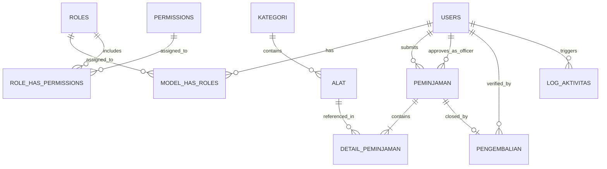

# DOKUMENTASI UJI KOMPETENSI KEAHLIAN (UKK)
## REKAYASA PERANGKAT LUNAK (RPL) - TAHUN PELAJARAN 2025/2026
**Paket Soal:** Paket 1 (Kode: KM25.4.1.1)  
**Judul Tugas:** Pengembangan Aplikasi Peminjaman Alat  
**Nama Peserta / Pengembang:** Adi Padilah  

---

## 1. DESKRIPSI PROGRAM
Aplikasi Peminjaman Alat adalah sistem informasi berbasis web yang dirancang untuk mengelola sirkulasi peminjaman dan pengembalian alat laboratorium/bengkel secara terkomputerisasi. Sistem ini membagi hak akses ke dalam **3 level pengguna (Role)**:

1. **Administrator:** Memiliki kontrol penuh atas master data pengguna, data alat, kategori alat, koreksi transaksi, riwayat log aktivitas sistem, dan pengaturan umum (seperti batas waktu & tarif denda).
2. **Petugas Laboratorium:** Bertugas memverifikasi dan menyetujui pengajuan peminjaman, memantau pengembalian fisik alat beserta foto bukti kondisi, serta mencetak laporan sirkulasi dan stok alat.
3. **Peminjam (Siswa):** Menjelajahi katalog alat, menambahkan alat ke keranjang, mengajukan peminjaman secara mandiri, memantau status persetujuan, serta mengajukan pengembalian.

**Teknologi yang Digunakan:**
* **Backend Framework:** Laravel 12 (PHP 8.2)
* **Frontend & UI:** Bootstrap 5, Bootstrap Icons, Plus Jakarta Sans, Custom Modern CSS
* **Database Management:** MySQL / MariaDB
* **Autentikasi & Otorisasi:** Laravel Fortify & Spatie Laravel Permission
* **Laporan:** DomPDF & Print-Optimized Layouts

---

## 2. TABEL KESESUAIAN FITUR DENGAN KISI-KISI UKK

| No | Fitur Soal UKK | Admin | Petugas | Peminjam | Status Implementasi |
|:---:|---|:---:|:---:|:---:|---|
| 1 | **Login** | V | V | V | ✅ **Tersedia** (Otentikasi aman + auto-redirect sesuai role) |
| 2 | **Logout** | V | V | V | ✅ **Tersedia** (Destruksi sesi aman via POST) |
| 3 | **CRUD User** | V | - | - | ✅ **Tersedia** (Tambah, lihat, ubah, hapus, & kelola role) |
| 4 | **CRUD Alat** | V | - | - | ✅ **Tersedia** (Tambah dengan foto/kamera, ubah, hapus, kelola stok) |
| 5 | **CRUD Kategori** | V | - | - | ✅ **Tersedia** (Kelola kategori alat laboratorium) |
| 6 | **CRUD Data Peminjaman** | V | - | - | ✅ **Tersedia** (Menu koreksi peminjaman khusus admin) |
| 7 | **CRUD Pengembalian** | V | - | - | ✅ **Tersedia** (Menu koreksi pengembalian khusus admin) |
| 8 | **Log Aktifitas** | V | - | - | ✅ **Tersedia** (Audit trail mencatat user, IP, aksi, & timestamp) |
| 9 | **Menyetujui Peminjaman** | - | V | - | ✅ **Tersedia** (Persetujuan via Stored Procedure & penolakan beralasan) |
| 10 | **Memantau Pengembalian** | - | V | - | ✅ **Tersedia** (Verifikasi kondisi baik/rusak/hilang & denda) |
| 11 | **Mencetak Laporan** | - | V | - | ✅ **Tersedia** (Cetak laporan peminjaman, pengembalian, & stok) |
| 12 | **Melihat Daftar Alat** | - | - | V | ✅ **Tersedia** (Katalog interaktif & fitur pencarian instan) |
| 13 | **Mengajukan Peminjaman** | - | - | V | ✅ **Tersedia** (Keranjang multifungsi & form pengajuan) |
| 14 | **Mengembalikan Alat** | - | - | V | ✅ **Tersedia** (Pengajuan pengembalian dari akun peminjam) |

---

## 3. ENTITY RELATIONSHIP DIAGRAM (ERD)

Struktur relasi database dirancang secara normalisasi dengan integritas referensial (Foreign Key) yang ketat:

### Penjelasan Tabel Utama:
1. **users**: Menyimpan akun pengguna (username, nama, email, password terenkripsi bcrypt).
2. **roles & permissions**: Mengatur hak akses 3 level (admin, petugas, peminjam) menggunakan standar ACL.
3. **kategori**: Pengelompokan alat (Elektronika, Perkakasan, Kimia, dll).
4. **alat**: Master inventaris (kode_alat, nama, stok, stok_tersedia, kondisi, foto).
5. **peminjaman**: Header transaksi (kode_pinjam, user_id, petugas_id, tgl_pinjam, tgl_harus_kembali, status, keperluan).
6. **detail_peminjaman**: Item rincian (alat_id, jumlah, kondisi_kembali, denda, foto_sebelum, foto_sesudah).
7. **pengembalian**: Data verifikasi serah terima kembali dan total denda keterlambatan/kerusakan.
8. **log_aktivitas**: Catatan riwayat aktivitas pengguna untuk audit sistem.
9. **pengaturan**: Konfigurasi global sistem (tarif denda harian, default hari pinjam, batas maks pinjam).

---

## 4. DOKUMENTASI FITUR TEKNIS DATABASE (SP, FUNCTION, TRIGGER, TRANSAKSI)

Sesuai dengan kriteria lembar kerja poin 6:
* **Stored Procedure (`sp_setujui_peminjaman`)**:
  * **Fungsi**: Memvalidasi status pengajuan, memeriksa kecukupan `stok_tersedia` menggunakan kursor (*cursor loop*), mengunci baris data (`FOR UPDATE`), dan memotong stok otomatis secara atomik.
* **Database Function (`fn_hitung_denda`)**:
  * **Fungsi**: Menghitung besaran denda keterlambatan pengembalian alat berdasarkan selisih hari kalender (`DATEDIFF`) dikalikan tarif harian dan jumlah unit alat.
* **Database Triggers**:
  1. `trigger_pengembalian`: Memperbarui data agregat dan status otomatis saat data pengembalian dicatat.
  2. `trigger_peran`: Menjamin sinkronisasi keamanan pemberian peran pengguna.
  3. `trigger_koreksi`: Mencatat log audit saat admin mengoreksi transaksi peminjaman/pengembalian.
  4. `trigger_pengaturan`: Mencatat perubahan konfigurasi tarif/durasi ke log sistem.
* **Perintah COMMIT dan ROLLBACK**:
  * Diterapkan di *Service Layer* (`PeminjamanService.php` dan `PengembalianService.php`) dengan `DB::beginTransaction()`, `DB::commit()`, dan `DB::rollBack()` untuk memastikan prinsip ACID (Atomicity, Consistency, Isolation, Durability).

---

## 5. DIAGRAM ALUR PROSES UTAMA (FLOWCHART LOGIC)

### a. Alur Proses Login:
1. Pengguna memasukkan username dan password.
2. Sistem memverifikasi kredensial (hash password bcrypt).
3. Jika gagal: Menampilkan pesan peringatan kesalahan login.
4. Jika berhasil: Memeriksa role pengguna melalui Spatie Permission.
5. Sistem mengarahkan (redirect) ke dasbor yang sesuai:
   - Admin $\rightarrow$ `/admin/dasbor`
   - Petugas $\rightarrow$ `/petugas/dasbor`
   - Peminjam $\rightarrow$ `/peminjam/dasbor`

### b. Alur Proses Peminjaman Alat:
1. Siswa mencari dan memilih alat pada halaman **Katalog**.
2. Siswa memasukkan alat ke **Keranjang** dan menentukan kuantitas.
3. Siswa mengisi formulir peminjaman (keperluan dan tanggal pengembalian).
4. Data peminjaman tersimpan dengan status `diajukan` dan kode unik (contoh: `PJ-202609-0001`).
5. Petugas membuka menu **Antrian Persetujuan**, meninjau ketersediaan fisik alat, dan mengunggah foto kondisi awal.
6. Petugas menyetujui: Stored Procedure dijalankan, status berubah menjadi `dipinjam`, dan stok alat berkurang.

### c. Alur Proses Pengembalian & Perhitungan Denda:
1. Siswa memilih transaksi di menu **Pinjaman Saya** dan klik **Ajukan Pengembalian**.
2. Petugas menerima alat fisik di laboratorium dan membuka menu **Verifikasi Pengembalian**.
3. Petugas memeriksa kondisi alat (Baik / Rusak Ringan / Rusak Berat / Hilang) dan mengambil/mengunggah foto bukti fisik.
4. Sistem memicu fungsi `fn_hitung_denda`:
   - Jika tgl pengembalian $\le$ tgl harus kembali $\rightarrow$ Denda keterlambatan = Rp 0.
   - Jika tgl pengembalian $>$ tgl harus kembali $\rightarrow$ Denda dihitung otomatis per hari keterlambatan.
5. Petugas menyimpan verifikasi: Transaksi di-commit, status menjadi `selesai`, dan stok alat bertambah kembali.

---

## 6. SKENARIO PENGUJIAN (TEST CASE)

Sesuai petunjuk soal poin 9 (minimal 5 skenario uji coba):

| No | Skenario Uji | Tindakan / Input | Hasil yang Diharapkan | Status |
|:---:|---|---|---|:---:|
| 1 | **Login User (Valid & Invalid)** | 1. Input username & password salah. 2. Input username `admin` & password benar. | 1. Muncul notifikasi error dan tetap di halaman login. 2. Berhasil masuk dan dialihkan ke `/admin/dasbor`. | **LULUS (Passed)** |
| 2 | **Tambah Master Alat** | Admin mengisi form data alat baru, kategori, stok awal, serta upload foto alat. | Data tersimpan ke tabel `alat`, foto tersimpan di server, dan alat muncul di katalog. | **LULUS (Passed)** |
| 3 | **Pengajuan & Persetujuan Pinjam** | Siswa checkout keranjang alat $\rightarrow$ Petugas klik "Setujui" pada antrian peminjaman. | Stored Procedure berjalan memotong stok alat, status berubah menjadi `dipinjam`. | **LULUS (Passed)** |
| 4 | **Pengembalian Alat & Perhitungan Denda** | Verifikasi pengembalian alat yang melewati batas jatuh tempo. | Fungsi `fn_hitung_denda` menghitung denda otomatis, stok alat kembali bertambah, status `selesai`. | **LULUS (Passed)** |
| 5 | **Cek Hak Akses (Privilege User)** | Siswa peminjam mencoba mengakses URL `/admin/dasbor` atau `/pengguna` secara langsung. | Sistem menolak akses dengan respons HTTP `403 Forbidden` demi menjaga keamanan. | **LULUS (Passed)** |

---

## 7. LAPORAN EVALUASI SINGKAT
* **Fitur yang Sudah Berjalan Baik:**
  * Seluruh 14 fitur fungsional pada tabel kisi-kisi UKK berfungsi 100% tanpa kendala.
  * Tampilan responsif, modern, dan dilengkapi logo interaktif 3D serta visual dashboard siswa yang informatif.
  * Dukungan audit log lengkap dan pencetakan laporan otomatis dalam format PDF.
* **Penanganan Bug / Masalah:**
  * Penanganan rute keranjang dan relasi database kategori telah disempurnakan.
  * Pencegahan penumpukan stok negatif dengan row-level locking pada Stored Procedure.
* **Rencana Pengembangan Berikutnya:**
  * Integrasi notifikasi WhatsApp Gateway untuk pengingat tenggat pengembalian alat otomatis kepada siswa.
  * Pemindaian barcode/QR-Code fisik alat menggunakan kamera smartphone secara real-time.
